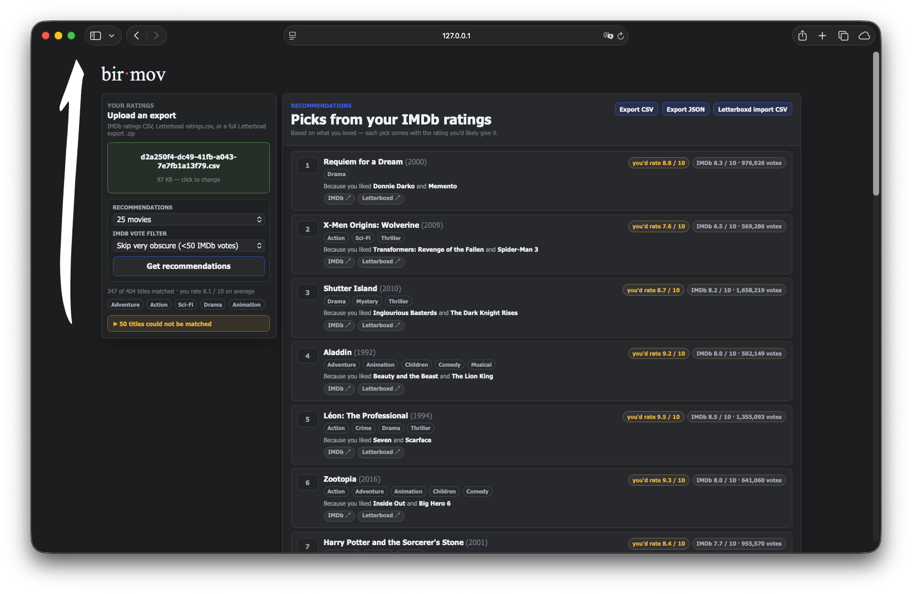

# bir.mov

Personal movie recommendations from your own IMDb or Letterboxd ratings.

`bir.mov` folds a new user's exported ratings into two MovieLens-trained
collaborative-filtering models, then returns a watchlist with predicted personal
scores, "because you liked..." explanations, and live IMDb rating context.



## Features

- Upload an IMDb ratings CSV, a Letterboxd `ratings.csv`, or a full Letterboxd
  export `.zip`.
- Match uploaded titles to the MovieLens ml-32m catalog by IMDb id or normalized
  title + release year.
- Rank recommendations with an implicit-feedback ALS model.
- Predict the score you would likely give each film with an explicit matrix
  factorization model.
- Show the current IMDb average rating and vote count beside your predicted
  score.
- Filter recommendations by IMDb vote count to tune obscurity.
- Export recommendations as CSV, JSON, or a Letterboxd import CSV.

## How It Works

The app uses two model artifacts trained on MovieLens ml-32m:

- [`mskayacioglu/ml32m-als128-v1`](https://huggingface.co/mskayacioglu/ml32m-als128-v1)
  ranks candidate films.
- [`mskayacioglu/ml32m-mf128-v1`](https://huggingface.co/mskayacioglu/ml32m-mf128-v1)
  predicts the user's likely rating.

The models do not store a factor vector for a brand-new user. At request time,
the uploaded ratings are folded in:

- ALS uses `recalculate_user` over the user's liked movies.
- MF solves a small ridge-regression problem against frozen item factors.

IMDb public ratings are read from IMDb's official Non-Commercial Datasets. On
each server start, `title.ratings.tsv.gz` is refreshed from
`https://datasets.imdbws.com/` into `data/`. The file is gitignored and is not
redistributed. If IMDb cannot be reached, the app falls back to the last local
copy when one exists.

## Quick Start

Clone the repo:

```bash
git clone https://github.com/bir-ai/bir-mov.git
cd bir-mov
```

Download MovieLens ml-32m from
[GroupLens](https://grouplens.org/datasets/movielens/32m/) and unzip it into
`./ml-32m`. At runtime, the app needs:

```text
ml-32m/movies.csv
ml-32m/links.csv
```

Start the app:

```bash
scripts/run_server.sh
```

Open [http://127.0.0.1:8360](http://127.0.0.1:8360).

The run script creates `.venv-server`, installs Python dependencies when
needed, refreshes the IMDb ratings cache on startup, and launches Uvicorn.

Model artifacts are downloaded automatically into `.hf-cache/` when the server
starts and no local model copy exists. To place a local copy under `./model/`
instead, run:

```bash
scripts/download_models.sh
```

## Export Your Ratings

bir.mov works with your own rating export from IMDb or Letterboxd.

### IMDb

1. Go to [IMDb Exports](https://www.imdb.com/exports/).
2. Sign in with the IMDb account that contains your ratings.
3. Request or download your ratings export.
4. Upload the resulting ratings CSV in bir.mov.

The app reads IMDb exports by `tt` id, so IMDb uploads are matched directly
against MovieLens `links.csv`.

### Letterboxd

1. Go to [Letterboxd data settings](https://letterboxd.com/settings/data/).
2. Sign in with the Letterboxd account that contains your diary/ratings.
3. Export your account data.
4. Upload either the full Letterboxd `.zip` export or the included
   `ratings.csv` file in bir.mov.

Letterboxd uploads are matched by normalized title and release year, with a
small year tolerance for catalog differences.

## Data And Artifacts

This repository intentionally does not ship large or redistributable data:

- `ml-32m/` is ignored; download MovieLens separately.
- `data/title.ratings.tsv.gz` is ignored; it is fetched from IMDb on startup.
- `model/` is ignored; use `scripts/download_models.sh` to populate it from
  Hugging Face when you want a local copy.
- `.hf-cache/` is ignored; it is used by `huggingface_hub` as the automatic
  model download cache.

### Model Artifacts

The model cards and binary artifacts live on Hugging Face:

- ALS ranking model:
  [`mskayacioglu/ml32m-als128-v1`](https://huggingface.co/mskayacioglu/ml32m-als128-v1)
- MF scoring model:
  [`mskayacioglu/ml32m-mf128-v1`](https://huggingface.co/mskayacioglu/ml32m-mf128-v1)

These artifacts are derived from MovieLens ml-32m and are distributed under the
MovieLens dataset terms. Commercial or revenue-bearing use requires permission
from GroupLens.

IMDb data is used under IMDb's Non-Commercial Datasets terms. MovieLens data is
provided by GroupLens. This project is not affiliated with IMDb, Letterboxd, or
GroupLens.

## Project Structure

```text
app/              FastAPI backend
  catalog.py      MovieLens catalog, IMDb ratings, title/year matching
  imdb_data.py    IMDb dataset refresh and parsing
  main.py         API and static hosting
  parsers.py      IMDb and Letterboxd export parsing
  recommender.py  model loading, user fold-in, ranking, scoring
web/              static frontend
scripts/          local run helpers
docs/             README assets
model/            ignored local model artifacts downloaded from Hugging Face
```

## Links

- Repository: [github.com/bir-ai/bir-mov](https://github.com/bir-ai/bir-mov)
- Organization: [github.com/bir-ai](https://github.com/bir-ai)
